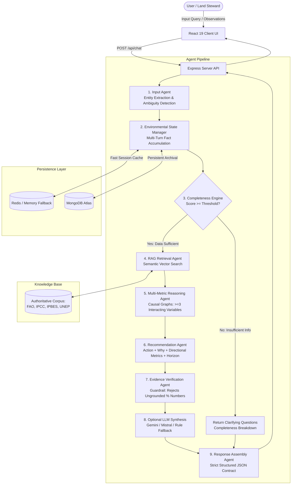

# Darukaa.Earth — AI Environmental Intelligence Engine

> An authoritative, multi-agent AI environmental scientist and biodiversity decision-support platform designed to diagnose land degradation, reason across interacting ecological variables, and deliver scientifically grounded agroecological recommendations.

---

## Table of Contents

1. [System Architecture](#system-architecture)
   - [High-Level Overview](#high-level-overview)
   - [Multi-Agent Pipeline](#multi-agent-pipeline)
   - [Knowledge Retrieval (RAG)](#knowledge-retrieval-rag)
   - [Technology Stack](#technology-stack)
2. [Database & Schema Design](#database--schema-design)
   - [MongoDB Persistence Models](#mongodb-persistence-models)
   - [Redis Caching & Session Store](#redis-caching--session-store)
   - [Domain Schema (Zod Validation)](#domain-schema-zod-validation)
3. [Local Development Setup](#local-development-setup)
   - [Prerequisites](#prerequisites)
   - [Repository Layout](#repository-layout)
   - [Environment Variables](#environment-variables)
   - [Installation & Execution](#installation--execution)
   - [Running the Test Suite](#running-the-test-suite)
4. [CI/CD Pipeline Details](#cicd-pipeline-details)
   - [Continuous Integration (CI)](#continuous-integration-ci)
   - [Continuous Deployment (CD) & Production Bundling](#continuous-deployment-cd--production-bundling)
   - [GitHub Actions Workflow](#github-actions-workflow)
5. [API Reference](#api-reference)

---

## System Architecture

### High-Level Overview

Darukaa.Earth operates on a decoupled client-server architecture:
- **Client (Frontend)**: React 19 + TypeScript + Vite SPA offering interactive conversational interfaces, real-time completeness gauges, causal graph visualizations, and scientific evidence inspectors.
- **Server (Backend)**: Node.js + Express + TypeScript orchestration engine housing a multi-agent environmental pipeline, knowledge retrieval (RAG), and hybrid persistence (Redis + MongoDB Atlas with automated in-memory fallbacks).



### Multi-Agent Pipeline

The core backend implements a specialized multi-agent workflow:

1. **Input Agent (`src/agents/inputAgent.ts`)**: Parses natural language text or structured JSON payloads, identifies environmental parameters (soil, climate, land use), and normalizes values.
2. **Environmental State Manager (`src/memory/environmentalState.ts`)**: Maintains persistent, cumulative state across conversational turns so previous observations are preserved without user repetition.
3. **Completeness Engine (`src/environmental/validators.ts`)**: Calculates a weighted completeness score (0.0 to 1.0) against critical ecological parameters. If completeness is below threshold (`0.45`), the system generates targeted clarifying questions before prescribing interventions.
4. **Retrieval Agent & Vector Store (`src/agents/retrievalAgent.ts`, `src/rag/`)**: Searches scientific literature using cosine similarity and keyword weighting, filtering excerpts relevant to the active ecological conditions.
5. **Multi-Metric Reasoning Agent (`src/agents/reasoningAgent.ts`)**: Identifies causal relationships connecting **at least three interacting variables** (e.g., low soil organic carbon $\times$ low rainfall $\times$ monoculture cultivation) to avoid oversimplified monocausal recommendations.
6. **Recommendation Agent (`src/agents/recommendationAgent.ts`)**: Constructs tailored agroecological interventions comprising:
   - Specific intervention action
   - Scientific mechanism ("Why")
   - Expected directional metric changes (`increase`, `decrease`, `stabilize`)
   - Time horizon (`short_term`, `medium_term`, `long_term`)
   - Scientific citations & peer-reviewed sources
7. **Evidence Verification Agent (`src/agents/evidenceAgent.ts`)**: Enforces **strict numerical claim policies**—automatically flags or replaces arbitrary, ungrounded percentage estimates with empirical directional trends and documented scientific ranges.
8. **Response Agent (`src/agents/responseAgent.ts`)**: Validates and serializes the final payload into a deterministic `StructuredResponse`.

### Knowledge Retrieval (RAG)

- **Corpus Location**: `server/data/documents/scientific_corpus.json`
- **Authoritative Sources**: FAO (Food and Agriculture Organization), IPCC Assessment Reports, IPBES Global Assessment, UNEP soil guides, and peer-reviewed agroecological journals.
- **Embedding & Storage Engine**: In-memory vector store (`src/rag/vectorStore.ts`) with TF-IDF and term-weighted semantic embeddings (`src/rag/embeddings.ts`), supporting Cosine Similarity queries and metadata filtering by environmental variables.

### Technology Stack

| Domain | Technology | Description |
| :--- | :--- | :--- |
| **Frontend** | React 19, TypeScript, Vite, Lucide Icons | Responsive UI with state gauges, reasoning graph visualizer, and corpus modal |
| **Backend** | Node.js, Express, TypeScript, TSX | Modular REST API and agent orchestration pipeline |
| **Data Validation** | Zod | Runtime schema validation for environmental inputs and API responses |
| **Vector Search** | VectorStore (TF-IDF / Cosine Similarity) | Document chunking, indexing, and semantic retrieval |
| **Caching** | Redis (`ioredis`) with resilient in-memory fallback | Sub-millisecond session state and conversation cache |
| **Database** | MongoDB Atlas (`mongoose`) | Persistent storage for user sessions and environmental state |
| **Testing** | Vitest | Unit, integration, and scenario testing suite |
| **Linting** | Oxlint, TypeScript Compiler | Ultra-fast linter and type-checking |

---

## Database & Schema Design

### MongoDB Persistence Models

Configured in `server/src/services/mongoService.ts` using Mongoose:

#### 1. `Conversation` Collection (`ConversationModel`)
Stores message history across turns for each session:
```typescript
interface IConversationDocument extends Document {
  sessionId: string;           // Indexed & Unique identifier
  turns: Array<{
    id: string;                // Turn UUID
    role: 'user' | 'assistant';// Message author
    content: string;           // Message text or serialized payload
    timestamp: string;         // ISO timestamp
    metadata?: Record<string, any>;
  }>;
  createdAt: Date;
  updatedAt: Date;
}
```

#### 2. `EnvironmentalState` Collection (`EnvironmentalStateModel`)
Persists the accumulated ecological facts and completeness history:
```typescript
interface IEnvironmentalStateDocument extends Document {
  sessionId: string;           // Indexed & Unique identifier
  state: Record<string, any>;  // Accumulated environmental parameters
  completenessScore: number;   // Calculated completeness (0.0 - 1.0)
  createdAt: Date;
  updatedAt: Date;
}
```

### Redis Caching & Session Store

Implemented in `server/src/services/redisService.ts`:
- **Key Patterns**:
  - `darukaa:session:<sessionId>:turns` — Recent conversational history (TTL: 86,400s / 24h)
  - `darukaa:session:<sessionId>:state` — Active environmental parameters (TTL: 86,400s / 24h)
- **High-Availability Architecture**: If Redis is unreachable or credentials are not supplied, the service seamlessly transitions to an **in-memory `Map` fallback**, ensuring uninterrupted operation.

### Domain Schema (Zod Validation)

Defined in `server/src/environmental/schema.ts`:

- **`SoilHealthSchema`**: `ph` (0–14), `organic_carbon_percent` (0–100), `moisture_percent` (0–100), `nutrients`, `degradation_level`, `microbial_activity`.
- **`LandUseSchema`**: `type` (`cropland`, `forest`, `grassland`, `wetland`, `urban`, `bare`), `crop`, `cropping_system` (`monoculture`, `polyculture`, `agroforestry`, `crop_rotation`, `strip_cropping`), `habitat_fragmentation`.
- **`ClimateSchema`**: `region`, `temperature_c`, `rainfall` (`low` | `moderate` | `high` | number), `drought_conditions`, `heat_stress`.
- **`BiodiversitySchema`**: `species_richness`, `species_diversity`, `pollinator_presence`, `native_vegetation`, `ecological_connectivity`.
- **`HumanImpactSchema`**: `pollution`, `deforestation`, `pesticide_intensity`, `water_extraction`, `urbanization`.
- **`StructuredResponse`**: Strict API contract guaranteeing `answer`, `environmental_assessment`, `completeness`, `reasoning_graph`, `recommendations`, `sources`, and `clarifying_questions`.

---

## Local Development Setup

### Prerequisites

- **Node.js**: `v18.0.0` or later (tested on Node v20/v22)
- **npm**: `v9.0.0` or later
- *(Optional)* **MongoDB & Redis**: Not strictly required for development—in-memory fallbacks automatically engage if remote credentials are absent.

### Repository Layout

```text
.
├── client/                     # React 19 Frontend application
│   ├── src/
│   │   ├── components/         # Chat, EvidenceCard, ReasoningGraph, etc.
│   │   ├── services/api.ts     # Client HTTP service
│   │   ├── types/              # TypeScript definitions
│   │   ├── App.tsx             # Main application container
│   │   └── main.tsx            # Entry point
│   ├── package.json
│   └── vite.config.ts          # Vite configuration with /api reverse proxy
├── server/                     # Node.js Express Backend
│   ├── data/documents/         # Authoritative scientific corpus JSON
│   ├── src/
│   │   ├── agents/             # Multi-agent implementations
│   │   ├── environmental/      # Domain schemas and validators
│   │   ├── memory/             # State and conversation managers
│   │   ├── rag/                # Embeddings, vector store, and ingestion
│   │   ├── routes/             # Express routes (/api/chat, /api/environmental)
│   │   ├── services/           # Redis, MongoDB, and LLM integrations
│   │   ├── app.ts              # Express application setup
│   │   └── server.ts           # Server bootstrap & document ingestion
│   ├── tests/                  # Vitest test suites (scenarios, mongo, redis)
│   ├── package.json
│   └── tsconfig.json
└── README.md                   # Project documentation
```

### Environment Variables

Create a `.env` file inside the `server/` folder (a `.env.example` template is provided below):

```env
# Server Network Settings
PORT=5000
CLIENT_URL=http://localhost:5173

# Optional Remote Persistence (Automated in-memory fallback if omitted)
MONGODB_URI=mongodb+srv://<username>:<password>@<cluster>.mongodb.net/darukaa_ai?retryWrites=true&w=majority
REDIS_URL=redis://default:<password>@<host>:<port>

# Optional LLM Acceleration (Platform uses built-in scientific engine by default)
GEMINI_API_KEY=your_gemini_api_key_here
GEMINI_MODEL=gemini-2.5-flash

MISTRAL_API_KEY=your_mistral_api_key_here
MISTRAL_MODEL=mistral-small-2603

# Retrieval & Evaluation Parameters
VECTOR_TOP_K=5
MIN_EVIDENCE_RELEVANCE=0.65
COMPLETENESS_THRESHOLD=0.45
```

### Installation & Execution

#### 1. Backend Server Setup
```bash
cd server
npm install
npm run dev
```
The server will initialize the vector corpus, connect to persistence services, and start on `http://localhost:5000`.

#### 2. Frontend Client Setup
In a separate terminal:
```bash
cd client
npm install
npm run dev
```
The client will start on `http://localhost:5173`. Proxied calls to `/api/*` are forwarded directly to the backend.

### Running the Test Suite

The test suite covers unit tests, persistence tests, and mandated scenario requirements:

```bash
cd server

# Run all test suites
npm test

# Run scenario-specific tests
npm run test:scenarios
```

#### Test Coverage Summary:
- `tests/scenarios.test.ts`:
  - **Scenario 1**: Missing data detection & generation of targeted clarifying questions.
  - **Scenario 2**: Multi-metric reasoning across $\ge 3$ environmental variables.
  - **Scenario 3**: Evidence grounding in authoritative sources (FAO/IPCC/UNEP/IPBES).
  - **Scenario 4**: Guardrail validation against unsupported numerical percentage claims.
  - **Scenario 5**: Multi-turn cumulative state accumulation.
  - **Scenario 6**: Dynamic constraint adaptation (e.g. accommodating crop retention).
- `tests/mongo.test.ts`: MongoDB Atlas connection, conversation turn persistence, and state retrieval.
- `tests/redis.test.ts`: Redis caching, TTL operations, and fallback validation.

---

## CI/CD Pipeline Details

### Continuous Integration (CI)

The CI pipeline runs automated checks on every pull request and push to the `main` branch:
1. **Type Checking & Linting**:
   - Client: `oxlint` for rapid linter validation and `tsc -b` for strict type safety.
   - Server: `tsc --noEmit` to verify type safety across all agents and services.
2. **Automated Unit & Scenario Tests**:
   - Runs `vitest run` on the server suite to validate multi-agent interactions, grounding policies, and schema contracts.
3. **Artifact Build Verification**:
   - Builds production assets for both frontend (`vite build`) and backend (`tsc`).

### Continuous Deployment (CD) & Production Bundling

The platform supports both split-service deployment and **single-container unified deployment**:
- Running `npm run build` in the `client` generates optimized static assets into `client/dist`.
- `server/src/app.ts` is preconfigured to serve `client/dist` statically in production environments:
  ```typescript
  const clientDistPath = path.join(__dirname, '../../client/dist');
  if (fs.existsSync(clientDistPath)) {
    app.use(express.static(clientDistPath));
    app.get('*', (req, res, next) => {
      if (req.path.startsWith('/api') || req.path === '/health') return next();
      res.sendFile(path.join(clientDistPath, 'index.html'));
    });
  }
  ```
- This enables zero-config deployment on platforms such as Docker, Render, Railway, AWS ECS, or Google Cloud Run.

### GitHub Actions Workflow

Below is the workflow specification located at `.github/workflows/ci.yml`:

```yaml
name: Darukaa.Earth CI/CD Pipeline

on:
  push:
    branches: [main, master]
  pull_request:
    branches: [main, master]

jobs:
  validate-and-test:
    name: Lint, Build & Test
    runs-on: ubuntu-latest

    steps:
      - name: Checkout Code
        uses: actions/checkout@v4

      - name: Setup Node.js
        uses: actions/setup-node@v4
        with:
          node-version: 20
          cache: 'npm'
          cache-dependency-path: |
            server/package-lock.json
            client/package-lock.json

      - name: Install Server Dependencies
        working-directory: ./server
        run: npm ci

      - name: Install Client Dependencies
        working-directory: ./client
        run: npm ci

      - name: Lint Client
        working-directory: ./client
        run: npm run lint

      - name: Type Check & Build Client
        working-directory: ./client
        run: npm run build

      - name: Build Server
        working-directory: ./server
        run: npm run build

      - name: Execute Server Vitest Suite
        working-directory: ./server
        env:
          PORT: 5000
          COMPLETENESS_THRESHOLD: 0.45
        run: npm test
```

---

## API Reference

### Health & Diagnostics
- **`GET /health`**  
  Returns system health, active database connectivity status (MongoDB and Redis), and server timestamp.

### Environmental Chat & Inference
- **`POST /api/chat`**  
  Main entry point for agent evaluation and recommendations.
  - **Body**:
    ```json
    {
      "message": "My land is in a semi-arid zone with low rainfall and SOC of 0.3%. I grow monoculture wheat.",
      "sessionId": "farmer-field-01",
      "reset": false
    }
    ```
  - **Response Structure**: See `StructuredResponse` contract containing completeness scores, causal chains, validated recommendations with directional indicators, time horizons, and source citations.

- **`GET /api/chat/history/:sessionId`**  
  Retrieves conversation turn history for the specified session.

- **`POST /api/chat/reset`**  
  Clears accumulated state and conversational memory for a given session.

### Scientific Knowledge Base
- **`GET /api/environmental/corpus`**  
  Retrieves all indexed peer-reviewed scientific publications and metadata chunks from the local RAG knowledge base.

- **`GET /api/environmental/state/:sessionId`**  
  Inspects the active accumulated structured environmental parameters for a session.
